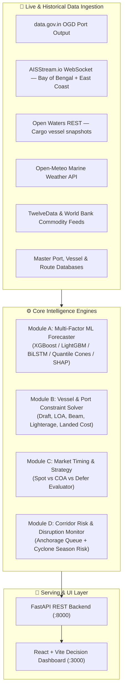

# 🚢 SIH26006: Intelligent Freight Forecasting & Vessel Chartering Optimization Platform

<div align="center">


**An AI-driven decision-support ecosystem for dry bulk cargo procurement and optimized vessel chartering to India's East Coast Ports.**

[Quick Start](#-quick-start) • [System Architecture](#-system-architecture) • [Core Engines](#-core-engines) • [Web Platform](#-web-platform) • [Project TODOs](#-project-todos--active-roadmap)

</div>

---

## 📌 Problem Overview & Impact

India's thermal power plants, steel mills, and heavy industrial hubs on the East Coast import millions of metric tonnes of **Thermal Coal, Coking Coal, Iron Ore, and Bauxite** annually from major overseas origins (Australia, USA, Mozambique, Russia, and Indonesia).

Currently, charterers and procurement managers rely on **daily reactive spot-market quotes**, leading to:
- ❌ **Sub-optimal entry timing** during global freight rate spikes.
- ❌ **Demurrage and lighterage penalties** due to uncoordinated vessel-port draft and LOA constraints (e.g. at Haldia, Paradip, and Vizag).
- ❌ **Lack of forward risk visibility** regarding Bay of Bengal cyclonic sea states and port anchorage queues.

### 💡 Our Solution
**FreightIQ (SIH26006)** is a 4-engine predictive intelligence and constraint optimization system that combines multi-factor machine learning, maritime operational constraints, real-time AIS vessel tracking, and forward rate simulation into an intuitive executive platform.

---

## 🗺️ System Architecture


```mermaid
flowchart TD
    subgraph Data_Layer ["📡 Live & Historical Data Ingestion"]
        D1[data.gov.in OGD Port Output]
        D2[AISStream.io WebSocket — Bay of Bengal + East Coast]
        D3[Open Waters REST — Cargo vessel snapshots]
        D4[Open-Meteo Marine Weather API]
        D5[TwelveData & World Bank Commodity Feeds]
        D6[Master Port, Vessel & Route Databases]
    end

    subgraph Core_Engines ["⚙️ Core Intelligence Engines"]
        M1["Module A: Multi-Factor ML Forecaster<br/>(XGBoost / LightGBM / BiLSTM / Quantile Cones / SHAP)"]
        M2["Module B: Vessel & Port Constraint Solver<br/>(Draft, LOA, Beam, Lighterage, Landed Cost)"]
        M3["Module C: Market Timing & Strategy<br/>(Spot vs COA vs Defer Evaluator)"]
        M4["Module D: Corridor Risk & Disruption Monitor<br/>(Anchorage Queue + Cyclone Season Risk)"]
    end

    subgraph Serving_Layer ["🚀 Serving & UI Layer"]
        API["FastAPI REST Backend (:8000)"]
        UI["React + Vite Decision Dashboard (:3000)"]
    end

    Data_Layer --> Core_Engines
    Core_Engines --> API
    API --> UI
```

---

## ⚙️ Core Engines

### 1. 📈 Module A: Freight Rate ML Forecaster
- **Dynamic ensemble** of XGBoost, LightGBM, ElasticNet, and BiLSTM — weights auto-adjusted by rolling backtest MAPE.
- **Multi-horizon recursive predictions** (4, 8, 12, 16, 24 weeks forward) in USD/MT.
- **80% & 90% Quantile Confidence Cones** to capture freight market volatility.
- **SHAP Feature Attribution** explaining key cost drivers (bunker fuel, BDI index, FX rates, port queues).
- Dedicated `FreightModelService` with 5-minute forecast cache; no external API calls in the serving path.

### 2. 🚢 Module B: Vessel & Port Constraint Solver
- Solves physical berth compatibility for **Handysize, Supramax, Ultramax, Panamax, Kamsarmax, and Capesize** vessels.
- Evaluates **maximum permissible draft, LOA, beam, and tidal windows** across 7 Indian East Coast ports (Paradip, Vizag, Gangavaram, Gopalpur, Dhamra, Sagar, Haldia).
- Computes **Total Landed Logistics Cost** ($\text{Freight} + \text{Port Dues} + \text{Mandatory Lighterage at Sagar} + \text{Demurrage Risk}$).
- DB-backed with JSON master fallback — no hard file-path dependency at runtime.

### 3. 🎯 Module C: Market Timing & Contract Strategy
- Evaluates instantaneous spot rates against forward multi-voyage contracts (COA).
- Outputs actionable procurement signals: `ENTER_NOW_SPOT`, `ENTER_NOW_TERM_CONTRACT`, or `WAIT_N_WEEKS`.
- **Spot → Multi-Voyage Contract Migration KPI** (`spot_to_contract_consolidation_pct` field in `MarketTimingEngine.evaluate_strategy()`):
  Directly implements the PS objective — *"Development of model to facilitate moving from multiple single spot contracts being entered into currently to short term / medium term multiple voyage contracts."*
  Tracks, across a rolling session window, what percentage of cargo volume decisions were routed to term/COA contracts vs. remaining on single spot fixtures. Displayed prominently on the **Strategy & Timing** page.
- **Idle Time Minimisation** (`idle_scenario_guidance` field):
  Implements the PS requirement — *"Propose strategies for minimising vessel idle time by forecasting periods of low demand and suggesting alternative employment opportunities or optimised positioning to reduce deadheading."*
  Returns graded `idle_risk_level` (Low / Medium / High) + numeric `idle_days_estimate` + real alternate routes from the 12-route master with per-option `estimated_savings_usd` vs. straight ballast return.

### 4. ⚠️ Module D: Corridor Risk & Disruption Monitor
- **Dual AIS ingestion**: AISStream.io WebSocket streaming to SQLite + Open Waters REST polling (default 45 s interval).
- Automatic reconnect with exponential back-off; last-known-good SQLite data rendered while socket is down.
- **Marine sea state & wave height monitoring** in the Bay of Bengal and Malacca Strait.
- Composite risk index (0–100) with automatic operational alerts.

---

## 🖥️ Web Platform

The interactive UI is built with **React + Vite** and features a modern dark glassmorphism design:

| Module Page | Description |
| :--- | :--- |
| **Command Center** | Live KPI summary cards, active risk alerts, recent scenarios table, system status bar. |
| **Forecast Analytics** | Interactive time-series charts with confidence cones, model-mode toggles (ensemble / XGB / LGB / BiLSTM), and SHAP drivers. |
| **Vessel Optimization** | Physical compatibility checker, landed cost rankings, and stacked cost component breakdowns. |
| **Route Intelligence** | MapLibre dark maritime map — trade route polylines, live AIS fleet, port/route filter sidebar, time scrubber with auto-play, vessel side panel. |
| **Risk Monitor** | Radial composite risk gauge, 30-day volatility trends, and marine disruption alerts. |
| **Strategy & Timing** | Timing signal indicators, forward freight curves, contract cost comparison, **Idle Risk & Alternate Employment card** (idle-days estimate + $ savings per alternate route), and **Spot → Multi-Voyage Contract Migration** KPI tile — all labelled in PS-verbatim language. |
| **AI Copilot** | Gemini-backed / rule-based briefing chat for on-demand procurement guidance. |

---

## ⚡ Quick Start

### 1-Command Automated Runner:
```bash
# Clone the repository
git clone https://github.com/Farhan-25/SIH-2026.git
cd SIH-2026

# Automatically sync Git, check dependencies, and launch both Backend & Frontend:
python sync_and_run.py
```

### Manual Setup:
```bash
# 1. Install Python dependencies in editable mode
pip install -e .

# 2. Start FastAPI Backend (Port 8000)
python -B -m uvicorn src.api.main:app --host 0.0.0.0 --port 8000 --reload

# 3. Start React Frontend (Port 3000)
cd frontend
npm install
npm run dev
```

For full setup documentation, environment key configuration, and troubleshooting, see [**`setup.md`**](file:///d:/SIH-2026/setup.md).

### 📚 Documentation & Reference Guides
All architecture specifications, engineering blueprints, and hackathon requirements are organized inside [`docs/`](file:///d:/SIH-2026/docs/):
- [**System Design & Architecture**](file:///d:/SIH-2026/docs/DESIGN.md)
- [**Technical Project Explanation**](file:///d:/SIH-2026/docs/PROJECT_EXPLANATION.md)
- [**Codebase Architecture Analysis**](file:///d:/SIH-2026/docs/SIH26006_Codebase_Analysis.md)
- [**SIH Execution Plan & Milestones**](file:///d:/SIH-2026/docs/SIH26006_Execution_Plan.md)
- [**News Sentiment & NLP Engine Reference**](file:///d:/SIH-2026/docs/news_sentiment.md)
- [**Problem Statement & Objectives**](file:///d:/SIH-2026/docs/ps.md)
- [**Requirements Specification**](file:///d:/SIH-2026/docs/requirement.md)

---

## 📋 Project TODOs & Active Roadmap

Below is the active task list for scaling this prototype to a national hackathon-winning production platform:

### 🧠 1. Machine Learning & Model Training Pipeline
- [x] **Train Deep Time-Series Models**: BiLSTM deep learning model alongside XGBoost/LightGBM for multi-horizon prediction.
- [x] **Dynamic Ensemble Engine**: Automated model selector that dynamically weights XGBoost, LightGBM, and ElasticNet based on rolling backtest MAPE.
- [x] **Inference Service**: `FreightModelService` with 5-minute forecast cache and zero external API dependency in the serving path.
- [x] **Automated Model Retraining Job**: Scheduled pipeline to re-fit models weekly as new OGD port and commodity data arrives.
- [x] **SHAP Interactive Visualizer**: Expose raw SHAP force plot JSON directly to the frontend for interactive node drill-downs.

### 🎨 2. UI/UX & Design Polish
- [x] **Route Map Filter Sidebar**: Port and route multi-select filters with `visibleRoutes` / `visibleVessels` memoized views.
- [x] **Time Scrubber**: 0–72 h forecast offset slider with auto-play loop on the Route Map.

- [x] **Light / Dark Theme Toggle**: Accessible light mode palette alongside current dark glassmorphism theme.
- [x] **Multi-Language Localization**: Hindi/English language toggle for national procurement accessibility.
- [x] **Scenario Export**: 1-click **Download PDF** procurement briefing for management review.

### 🚢 3. Advanced Optimization & Fleet Management
- [ ] **Multi-Parcel Fleet Scheduler**: Genetic Algorithm (NSGA-II) for scheduling multiple cargo parcels across multi-port discharge itineraries.
- [x] **Carbon Emission (EEXI / CII) Calculator**: Estimate voyage fuel burn and carbon intensity rating per vessel class.
- [ ] **Port Tariff Engine**: Dynamic tariff computation based on vessel Gross Tonnage (GT) and cargo handling productivity.

### 📰 4. NLP Market Sentiment & Macro Shocks
- [x] **Maritime News Sentiment Tracker**: Scrape and analyze global shipping headlines (Baltic Exchange, TradeWinds, Platts) with FinBERT to compute market sentiment scores.
- [x] **Geopolitical & Chokepoint Alerts**: Event-driven flags for Red Sea / Suez / Malacca transit disruptions.

### 🐳 5. DevOps & Presentation Deliverables
- [ ] **Docker Compose Setup**: Multi-container `docker-compose.yml` (FastAPI + Nginx React Frontend).
- [ ] **GitHub Actions CI/CD**: Automated linting and pytest pipeline on every push.
- [ ] **SIH Final Pitch Deck**: Slide deck highlighting ROI, landed cost savings (5–12%), and national logistics impact.

---

## 🧪 Testing & Validation

Run the automated test suite:
```bash
pytest tests/ -v
```

Tests cover: master dataset integrity, draft/lighterage constraints (Haldia & Gangavaram), ML inference pipeline, AIS/GFW client output shape, vessel optimizer rankings, and API endpoint health.

---

## 📄 License & Team
Developed for **Smart India Hackathon 2026 (SIH26006)**.  
Repository: [Farhan-25/SIH-2026](https://github.com/Farhan-25/SIH-2026)
