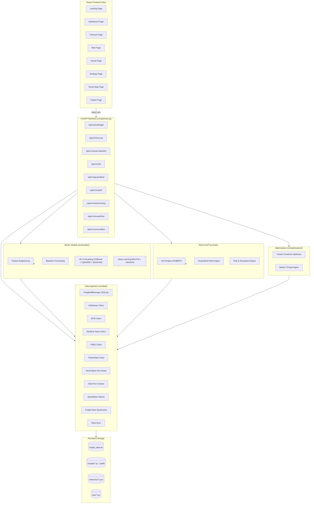
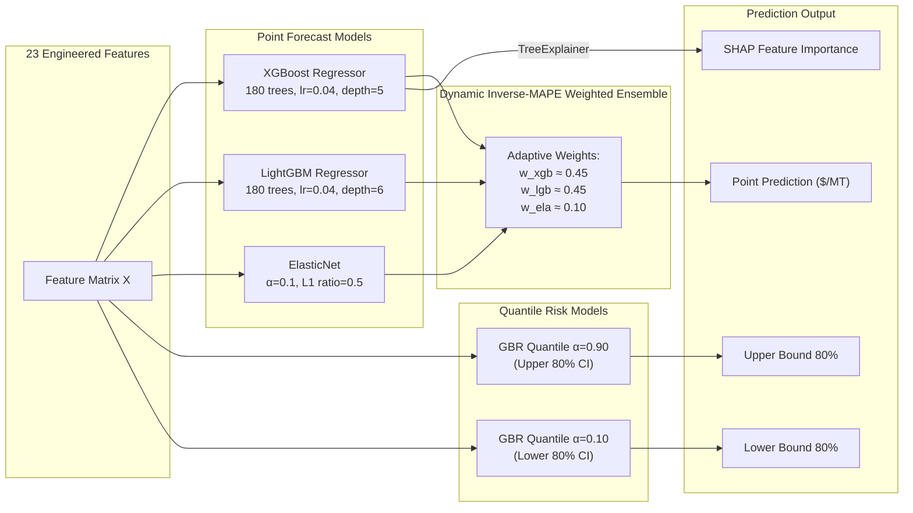
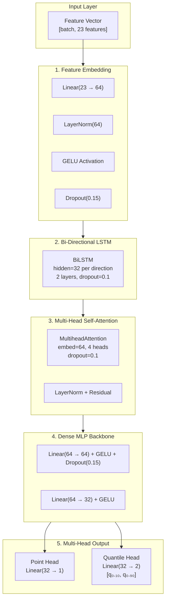
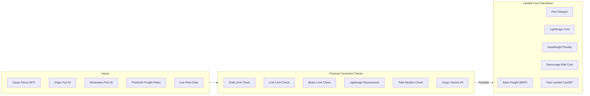
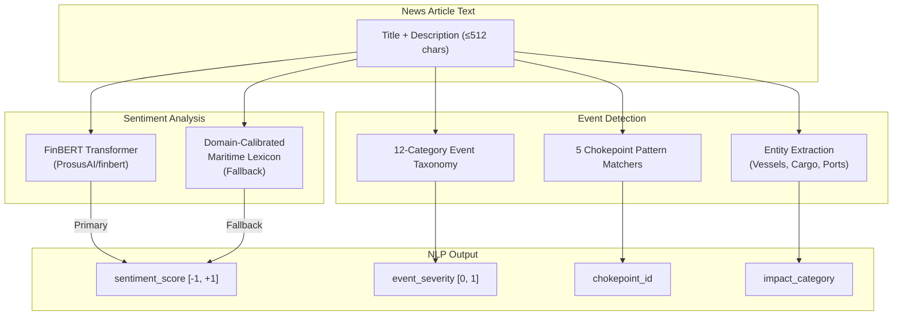
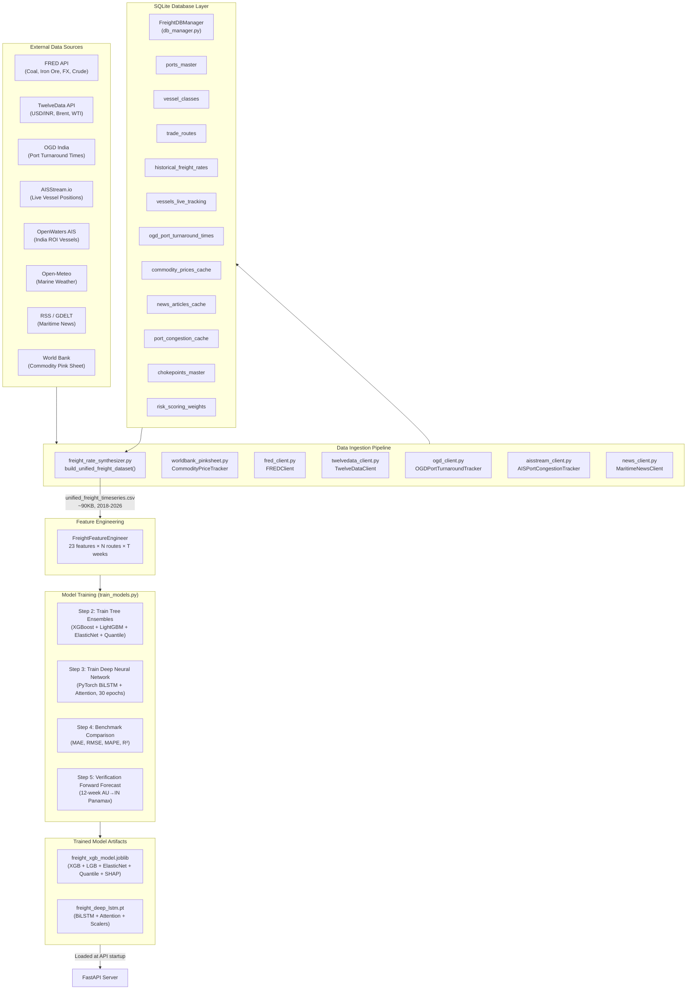

# SIH26006 — FreightIQ: Intelligent Freight Forecasting Platform
## Complete Codebase Analysis & Model Architecture

---

## 1. Project Overview

**FreightIQ** is an end-to-end AI-powered maritime freight rate forecasting and chartering optimization platform built for India's East Coast dry bulk trade corridors. It was developed for **Smart India Hackathon 2026 (Problem Statement SIH26006)**.

| Attribute | Detail |
|---|---|
| **Problem Domain** | Dry bulk freight rate forecasting & vessel chartering optimization |
| **Target Trade Corridors** | Australia → India East Coast, Indonesia → India, Mozambique → India |
| **Vessel Classes Covered** | Handysize, Supramax, Panamax, Kamsarmax, Capesize, Newcastlemax |
| **Cargo Types** | Thermal Coal, Coking Coal, Iron Ore, Bauxite |
| **Forecast Horizon** | 12-week multi-step recursive forecasting |
| **Backend** | Python 3.14, FastAPI, SQLite |
| **Frontend** | React (Vite), Leaflet Maps |
| **ML/DL Frameworks** | PyTorch, XGBoost, LightGBM, scikit-learn, SHAP, HuggingFace Transformers |

---

## 2. System Architecture



---

## 3. Module Breakdown

### Module A — Freight Rate Forecasting

> [!IMPORTANT]
> This is the core ML/DL module that powers all freight predictions. It uses a **3-tier model ensemble** plus a **deep neural network**.

#### 3.1 Feature Engineering Pipeline

**File:** [feature_engineering.py](file:///d:/SIH-2026/src/models/feature_engineering.py)

The `FreightFeatureEngineer` class constructs **23 features** from raw time-series data:

| Feature Category | Features | Count |
|---|---|---|
| **Autoregressive Lags** | `target_lag_1`, `target_lag_2`, `target_lag_4`, `target_lag_8`, `target_lag_12` | 5 |
| **Rolling Statistics** | `target_rolling_mean_4w`, `target_rolling_std_4w`, `target_rolling_mean_12w` | 3 |
| **Bunker Fuel Signals** | `bunker_lag_1`, `bunker_rolling_4w`, `fuel_to_freight_ratio` | 3 |
| **Commodity Price Lags** | `coal_lag_1`, `iron_ore_lag_1`, `coking_coal_lag_1` | 3 |
| **Macroeconomic** | `usd_inr_fx` | 1 |
| **Operational** | `congestion_index`, `distance_nm`, `sailing_days_one_way` | 3 |
| **Seasonal/Cyclical** | `monsoon_flag`, `month_sin`, `month_cos`, `quarter_sin`, `quarter_cos` | 5 |

#### 3.2 Baseline Forecasting

**File:** [baseline_forecasting.py](file:///d:/SIH-2026/src/models/baseline_forecasting.py)

Statistical benchmarks for performance comparison:

- **Naive** — Last-value persistence
- **SMA** — Simple Moving Average (configurable window, default 4)
- **EMA** — Exponential Moving Average (α = 0.3)

**Evaluation Metrics** (`compute_evaluation_metrics`):
- RMSE, MAE, MAPE (%), MDA (%), R² Score

#### 3.3 ML Ensemble Forecasting

**File:** [ml_forecasting.py](file:///d:/SIH-2026/src/models/ml_forecasting.py)

The `FreightMLForecaster` trains a **3-model weighted ensemble** with quantile risk bounds:



| Sub-Model | Hyperparameters | Ensemble Weight |
|---|---|---|
| **XGBoost** | 180 trees, lr=0.04, max_depth=5, subsample=0.85, colsample=0.85 | ~45% (dynamic) |
| **LightGBM** | 180 trees, lr=0.04, max_depth=6, 31 leaves, subsample=0.85 | ~45% (dynamic) |
| **ElasticNet** | α=0.1, L1_ratio=0.5 | ~10% (dynamic) |
| **Quantile Upper (GBR)** | α=0.90, 120 trees, depth=4 | — |
| **Quantile Lower (GBR)** | α=0.10, 120 trees, depth=4 | — |

**Key Design Decisions:**
- Ensemble weights are computed dynamically using **inverse-MAPE weighting** on the validation set
- SHAP TreeExplainer provides feature importance for explainability
- Recursive multi-step forecasting with autoregressive lag shifting

**Serialization:** `models/freight_xgb_model.joblib` (~1.5 MB)

#### 3.4 Deep Learning Neural Network

**File:** [deep_learning_forecaster.py](file:///d:/SIH-2026/src/models/deep_learning_forecaster.py)

The `FreightTransformerLSTM` is a hybrid deep architecture:



| Component | Architecture Detail |
|---|---|
| **Feature Embedding** | Linear(input→64) + LayerNorm + GELU + Dropout(0.15) |
| **Bi-LSTM** | 2-layer bidirectional, hidden_dim=32 per direction (64 total), dropout=0.1 |
| **Multi-Head Attention** | 4 heads, embed_dim=64, dropout=0.1, with residual connection & LayerNorm |
| **MLP Backbone** | 64→64→32, GELU activations, Dropout(0.15) |
| **Point Prediction Head** | Linear(32→1) |
| **Quantile Risk Head** | Linear(32→2) for [q₁₀, q₉₀] uncertainty bounds |

**Training Configuration:**

| Parameter | Value |
|---|---|
| Epochs | 30-35 |
| Batch Size | 64 |
| Learning Rate | 0.003 |
| Optimizer | AdamW (weight_decay=1e-4) |
| Scheduler | CosineAnnealingLR (eta_min=1e-5) |
| Loss | MSE + 0.3 × Pinball Quantile Loss |
| Gradient Clipping | max_norm=1.5 |
| Train/Test Split | 85% / 15% (temporal, no shuffle) |
| Feature Scaler | StandardScaler on X |
| Device | CUDA if available, else CPU |

**Serialization:** `models/freight_deep_lstm.pt` (~307 KB)

---

### Module B — Vessel Constraint Optimization

**File:** [vessel_optimizer.py](file:///d:/SIH-2026/src/optimization/vessel_optimizer.py)

The `VesselConstraintOptimizer` evaluates vessel physical feasibility and computes total landed logistics cost.



**Constraint Parameters per Port:**
- `max_permissible_draft_m`, `max_draft_with_tides_m`
- `max_loa_m`, `max_beam_m`, `max_dwt_capacity`
- `lighterage_required`, `average_output_per_ship_berthday_mt`
- `port_dues_usd_per_gt`, `pilotage_usd_per_gt`

---

### Module C — Market Timing & Strategy

**File:** [market_timing.py](file:///d:/SIH-2026/src/optimization/market_timing.py)

The `MarketTimingEngine` evaluates forward freight trajectories to recommend:

| Market Condition | Action | Trigger |
|---|---|---|
| Bullish (rates rising >8% over 12w) | `ENTER_NOW_TERM_CONTRACT` | Lock 6-month COA |
| Bearish (rates dropping >5% in 4w) | `WAIT_N_WEEKS` | Defer to price trough |
| Neutral | `ENTER_NOW_SPOT` | Execute immediate spot charter |

**Key Calculations & KPIs:**
- 4-week short-term average vs. 12-week mid-term average
- Term contract discount factor (5%)
- **Spot → Multi-Voyage Contract Migration KPI**: Tracks the percentage of decisions directed toward term/COA contracts (`spot_to_contract_consolidation_pct`).
- **Idle Time Minimisation**: Suggests quantified alternate routes to reduce deadheading when rates drop (returns `idle_risk_level`, `idle_days_estimate`, and `savings_vs_ballast_usd`).

---

### Module D — Risk & Disruption Intelligence

#### 3.5 NLP Engine (FinBERT + Lexicon)

**File:** [nlp_engine.py](file:///d:/SIH-2026/src/risk/nlp_engine.py)



**Event Taxonomy (12 categories):**

| Event Type | Default Severity | Impact Category |
|---|---|---|
| SECURITY_ATTACK | 0.92 | Critical Disruption |
| WAR_CONFLICT | 0.88 | High Disruption |
| VESSEL_DIVERSION | 0.85 | Major Supply Delay |
| CANAL_DISRUPTION | 0.80 | Chokepoint Bottleneck |
| PORT_CLOSURE | 0.78 | Terminal Shutdown |
| PORT_CONGESTION | 0.65 | Operational Delay |
| STRIKE | 0.62 | Labor Disruption |
| SANCTIONS | 0.58 | Regulatory Constraint |
| WEATHER | 0.55 | Meteorological Delay |
| INFRASTRUCTURE_FAILURE | 0.50 | Equipment Failure |
| INSURANCE_RISK | 0.55 | Cost Escalation |
| MARKET_EXPANSION | 0.15 | Capacity Addition |

**Monitored Chokepoints:**
Red Sea / Bab el-Mandeb, Suez Canal, Strait of Malacca, Panama Canal, Cape of Good Hope

#### 3.6 Geopolitical Risk Engine

**File:** [geopolitical_risk.py](file:///d:/SIH-2026/src/risk/geopolitical_risk.py)

**Maritime Disruption Risk Index Formula:**

```
Risk_Score = w_event × Event_Severity 
           + w_volume × News_Volume_Anomaly
           + w_sentiment × Negative_Sentiment
           + w_recency × Recency_Score
```

| Component | Default Weight | Range |
|---|---|---|
| Event Severity | 0.35 | [0, 1] — max of all matched articles |
| Volume Anomaly | 0.25 | [0, 1] — z-score normalized news volume |
| Negative Sentiment | 0.20 | [0, 1] — avg negative probability |
| Recency | 0.20 | [0, 1] — exponential decay over 48h |

**Risk Levels:** CRITICAL (≥0.75), HIGH (≥0.50), MODERATE (≥0.25), LOW (<0.25)

**Shock Alert Triggers:**
- `Risk_Score ≥ 0.75` OR (`z_score ≥ 2.0` AND `severity ≥ 0.75`) → CRITICAL SHOCK
- `Risk_Score ≥ 0.50` → WARNING

#### 3.7 Operational Risk Engine

**File:** [risk_engine.py](file:///d:/SIH-2026/src/risk/risk_engine.py)

**Composite Corridor Risk Score:**

```
Composite = 0.40 × dest_congestion 
          + 0.20 × origin_congestion 
          + 0.25 × weather_risk × 100 
          + 0.15 × market_volatility × 100
```

Data sources: Live AIS congestion, Open-Meteo marine weather, historical freight volatility.

---

### Module E — AI Copilot

**File:** [copilot_engine.py](file:///d:/SIH-2026/src/api/copilot_engine.py)

The `MaritimeCopilotEngine` synthesizes all analytics into conversational responses using **Google Gemini LLM** with **RAG grounding** from live system state (forecasts, SHAP, vessel constraints, FinBERT sentiment, chokepoint risks, commodity prices, AIS congestion).

---

## 4. Data Flow & Training Pipeline



### Training Pipeline (`train_models.py`)

| Step | Action | Output |
|---|---|---|
| **Step 1** | Build unified dataset from OGD + FRED + routes/vessels/ports | `data/processed/unified_freight_timeseries.csv` |
| **Step 2** | Train XGBoost + LightGBM + ElasticNet + Quantile GBRs | `models/freight_xgb_model.joblib` (1.5 MB) |
| **Step 3** | Train PyTorch BiLSTM+Attention (30 epochs, AdamW+CosineAnnealing) | `models/freight_deep_lstm.pt` (307 KB) |
| **Step 4** | Print benchmark comparison matrix across all models | Console output |
| **Step 5** | Run verification 12-week forecast + SHAP top features | Console output |

---

## 5. Data Sources Inventory

| Client Module | External API/Source | Data Provided | Caching |
|---|---|---|---|
| [fred_client.py](file:///d:/SIH-2026/src/data/fred_client.py) | FRED (St. Louis Fed) | Coal, Iron Ore, Crude Oil, FX rates, Industrial Production | SQLite + TTL |
| [twelvedata_client.py](file:///d:/SIH-2026/src/data/twelvedata_client.py) | TwelveData + Yahoo Finance | USD/INR, Brent/WTI spot, commodity tickers | In-memory + SQLite |
| [worldbank_pinksheet.py](file:///d:/SIH-2026/src/data/worldbank_pinksheet.py) | World Bank + TwelveData + FRED | Thermal/Coking Coal, Iron Ore, Bunker Fuel benchmarks | TTL (10min) |
| [ogd_client.py](file:///d:/SIH-2026/src/data/ogd_client.py) | data.gov.in (OGD) | Indian port turnaround times, berth-day output | SQLite seeded from CSV |
| [aisstream_client.py](file:///d:/SIH-2026/src/data/aisstream_client.py) | AISStream.io WebSocket + OpenWaters REST | Live vessel positions, port congestion metrics | SQLite (700 vessel cap) |
| [gfw_client.py](file:///d:/SIH-2026/src/data/gfw_client.py) | SQLite (AIS-ingested data) | Vessel positions for map, corridor demo fallback | In-memory |
| [news_client.py](file:///d:/SIH-2026/src/data/news_client.py) | RSS/GDELT | Maritime news articles, relevance filtering | SQLite + TTL |
| [openmeteo_client.py](file:///d:/SIH-2026/src/data/openmeteo_client.py) | Open-Meteo Marine API | Wave height, swell, wind speed, sea condition risk | In-memory (15min) |
| [fleet_sync.py](file:///d:/SIH-2026/src/data/fleet_sync.py) | AIS APIs → DB | Sync active fleet from live AIS data | On startup |

---

## 6. Database Schema (SQLite)

**Primary Database:** `data/processed/freight_data.db` (~7.9 MB)

| Table | Purpose |
|---|---|
| `ports_master` | 22+ fields per port (draft, LOA, beam, handling rates, charges) |
| `vessel_classes` | Capacity, dimensions, speed, geared status per class |
| `trade_routes` | Route IDs, distances, origin/destination ports |
| `historical_freight_rates` | Time-series freight rates per route × vessel class |
| `vessels_live_tracking` | Live AIS positions (lat, lon, speed, heading, timestamp) |
| `ogd_port_turnaround_times` | Official Indian port turnaround statistics |
| `commodity_prices_cache` | Cached commodity/FX prices with TTL |
| `news_articles_cache` | Cached NLP-processed news articles |
| `port_congestion_cache` | Computed congestion indices per port |
| `chokepoints_master` | Monitored maritime chokepoint definitions |
| `risk_scoring_weights` | Configurable weights for risk formula |

---

## 7. Frontend Architecture

| Page | File | Purpose |
|---|---|---|
| Landing | [LandingPage.jsx](file:///d:/SIH-2026/frontend/src/pages/LandingPage.jsx) | Product marketing page |
| Login | [LoginPage.jsx](file:///d:/SIH-2026/frontend/src/pages/LoginPage.jsx) | Auth (demo credentials) |
| Onboarding | [OnboardingPage.jsx](file:///d:/SIH-2026/frontend/src/pages/OnboardingPage.jsx) | Feature walkthrough |
| Dashboard | [DashboardPage.jsx](file:///d:/SIH-2026/frontend/src/pages/DashboardPage.jsx) | KPI overview |
| Forecast | [ForecastPage.jsx](file:///d:/SIH-2026/frontend/src/pages/ForecastPage.jsx) | Freight rate predictions & charts |
| Risk | [RiskPage.jsx](file:///d:/SIH-2026/frontend/src/pages/RiskPage.jsx) | Geopolitical risk & news sentiment |
| Route Map | [RouteMapPage.jsx](file:///d:/SIH-2026/frontend/src/pages/RouteMapPage.jsx) | Live vessel tracking (Leaflet) |
| Vessel | [VesselPage.jsx](file:///d:/SIH-2026/frontend/src/pages/VesselPage.jsx) | Vessel constraint optimization |
| Strategy | [StrategyPage.jsx](file:///d:/SIH-2026/frontend/src/pages/StrategyPage.jsx) | Market timing & contract strategy |
| Copilot | [CopilotPage.jsx](file:///d:/SIH-2026/frontend/src/pages/CopilotPage.jsx) | AI chat assistant (Gemini-powered) |

---

## 8. API Endpoints Summary

| Endpoint | Method | Module |
|---|---|---|
| `/api/v1/auth/login` | POST | Authentication |
| `/api/v1/forecast` | GET/POST | ML + DL Forecasting |
| `/api/v1/vessel-optimize` | POST | Vessel Constraint Optimizer |
| `/api/v1/market-timing` | POST | Market Strategy Engine |
| `/api/v1/risk` | GET | Operational Risk (AIS + Weather) |
| `/api/v1/geopolitical` | GET | Geopolitical Risk + NLP |
| `/api/v1/copilot` | POST | AI Copilot (Gemini RAG) |
| `/api/v1/vessels/live` | GET | Live AIS Vessel Positions |
| `/api/v1/commodities` | GET | Real-time Commodity Prices |

---

## 9. Key Dependencies

| Category | Libraries |
|---|---|
| **ML Core** | pandas, numpy, scipy, scikit-learn, statsmodels |
| **Gradient Boosting** | xgboost (≥2.0), lightgbm (≥4.0) |
| **Deep Learning** | torch (≥2.1, PyTorch) |
| **NLP** | transformers (≥4.35, HuggingFace), ProsusAI/finbert |
| **Explainability** | shap (≥0.43) |
| **Backend** | fastapi (≥0.104), uvicorn, pydantic (≥2.4) |
| **Data Feeds** | requests, websockets, python-dotenv |
| **Frontend** | React 18, Vite, Leaflet, Recharts |

---

## 10. Key File Index

| Path | Lines | Purpose |
|---|---|---|
| [src/api/main.py](file:///d:/SIH-2026/src/api/main.py) | 1,267 | FastAPI server — all endpoints |
| [src/api/copilot_engine.py](file:///d:/SIH-2026/src/api/copilot_engine.py) | 423 | Gemini LLM copilot with RAG |
| [src/data/db_manager.py](file:///d:/SIH-2026/src/data/db_manager.py) | 1,154 | SQLite ORM — schema, seeding, queries |
| [src/data/news_client.py](file:///d:/SIH-2026/src/data/news_client.py) | 394 | Maritime news RSS/GDELT ingestion |
| [src/data/aisstream_client.py](file:///d:/SIH-2026/src/data/aisstream_client.py) | 434 | AIS WebSocket + OpenWaters poller |
| [src/data/gfw_client.py](file:///d:/SIH-2026/src/data/gfw_client.py) | 396 | Vessel position map builder |
| [src/data/worldbank_pinksheet.py](file:///d:/SIH-2026/src/data/worldbank_pinksheet.py) | 346 | Commodity price tracker |
| [src/data/freight_rate_synthesizer.py](file:///d:/SIH-2026/src/data/freight_rate_synthesizer.py) | 167 | Unified dataset builder |
| [src/models/deep_learning_forecaster.py](file:///d:/SIH-2026/src/models/deep_learning_forecaster.py) | 355 | PyTorch BiLSTM + Attention |
| [src/models/ml_forecasting.py](file:///d:/SIH-2026/src/models/ml_forecasting.py) | 302 | XGBoost + LightGBM ensemble |
| [src/models/feature_engineering.py](file:///d:/SIH-2026/src/models/feature_engineering.py) | 100 | 23-feature engineering pipeline |
| [src/risk/nlp_engine.py](file:///d:/SIH-2026/src/risk/nlp_engine.py) | 304 | FinBERT sentiment + event taxonomy |
| [src/risk/geopolitical_risk.py](file:///d:/SIH-2026/src/risk/geopolitical_risk.py) | 347 | Chokepoint risk scoring |
| [src/risk/risk_engine.py](file:///d:/SIH-2026/src/risk/risk_engine.py) | 123 | Composite operational risk |
| [src/optimization/vessel_optimizer.py](file:///d:/SIH-2026/src/optimization/vessel_optimizer.py) | 250 | Physical feasibility + landed cost |
| [src/optimization/market_timing.py](file:///d:/SIH-2026/src/optimization/market_timing.py) | 101 | Spot vs. term contract strategy |
| [train_models.py](file:///d:/SIH-2026/train_models.py) | 111 | 1-command training pipeline |

**Total Backend Python:** ~6,000+ lines of production code across 20+ modules.

---

> [!TIP]
> To retrain all models, run: `python train_models.py` — this executes the full 5-step pipeline (data ingestion → feature engineering → tree ensemble training → deep learning training → benchmark evaluation).
